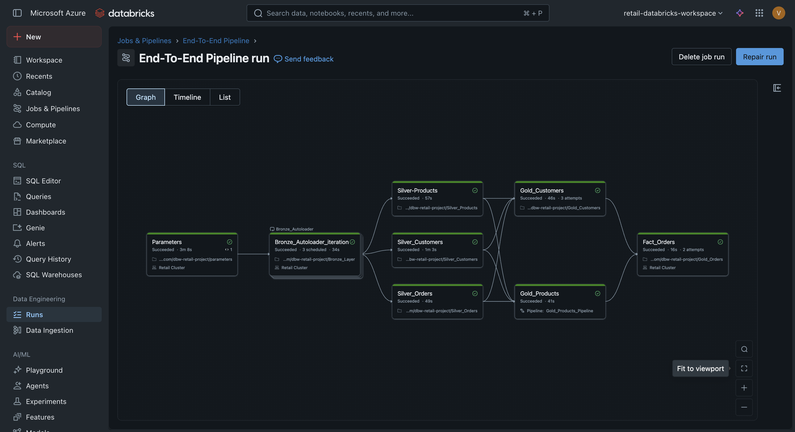
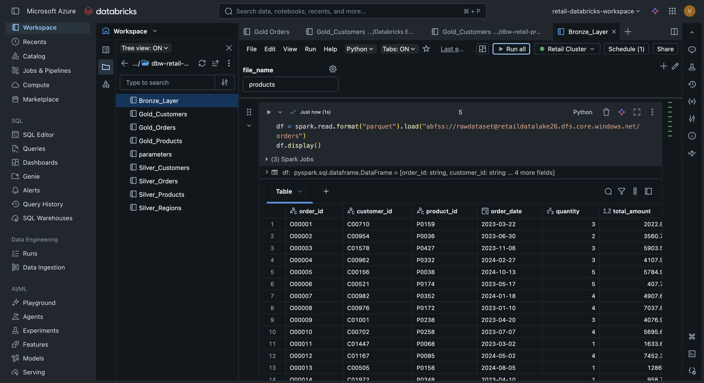
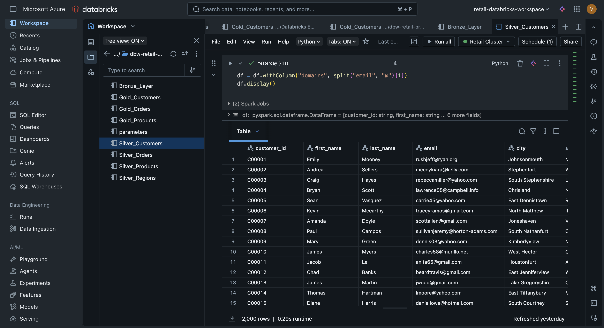
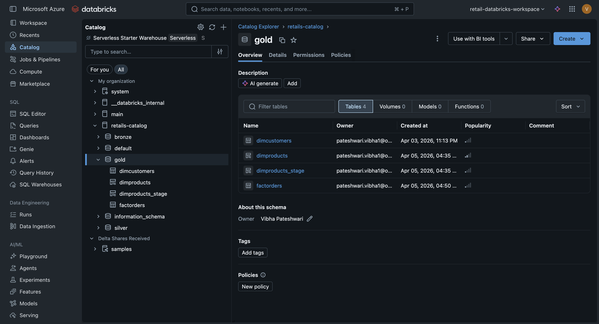
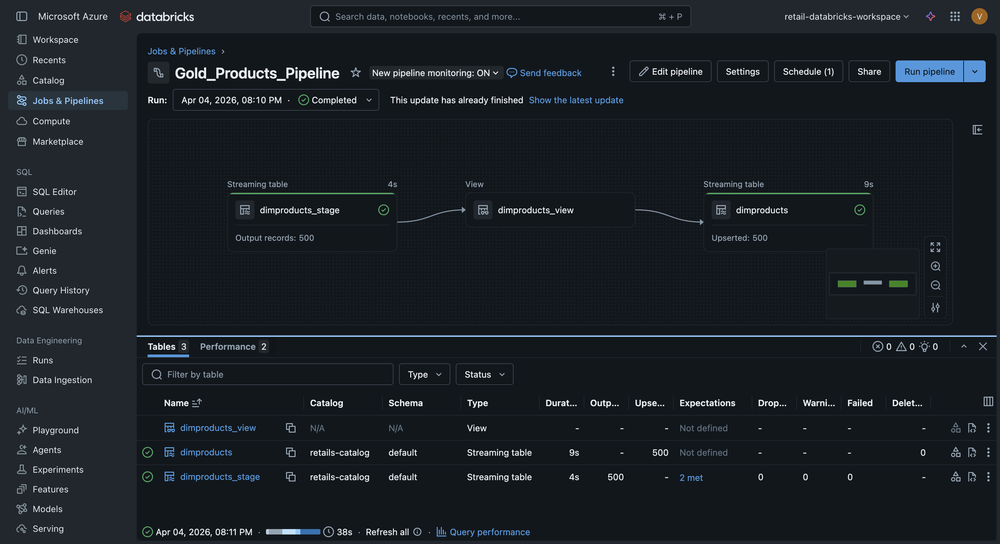
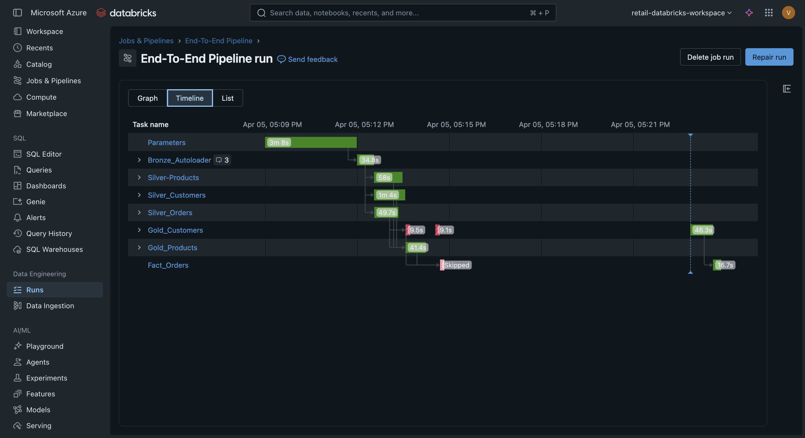
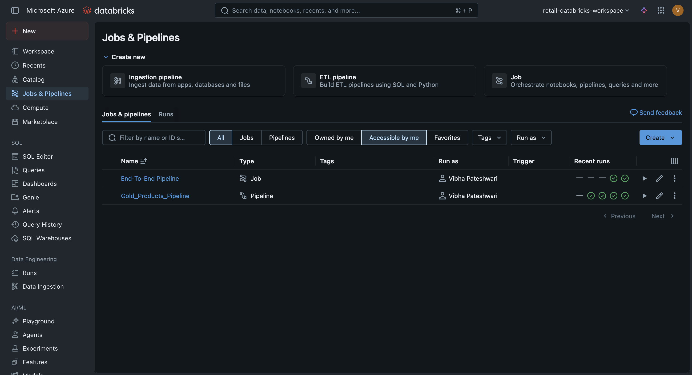
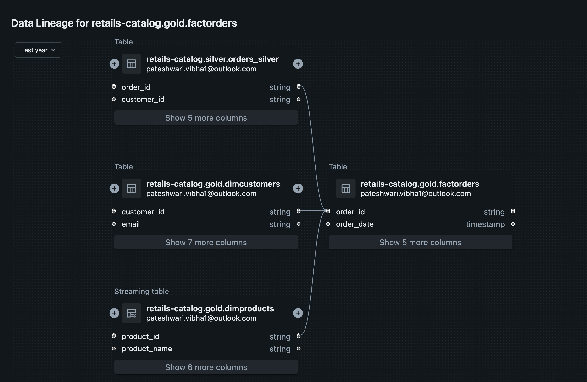

# 🚀 End-to-End Retail Data Engineering Pipeline (Azure + Databricks)

This project demonstrates a complete **end-to-end data engineering workflow** built using **Azure Databricks** and **ADLS Gen2**, following the **Medallion Architecture (Bronze → Silver → Gold)**.

The pipeline ingests raw data, performs transformations, and delivers analytics-ready data using a **Star Schema model**.

---

# 🏗️ Architecture Overview

### 🔄 End-to-End Pipeline Flow



### 🔹 Flow Explanation

* Raw data is ingested into **Bronze layer** using Autoloader
* Data is cleaned and transformed in **Silver layer**
* Business-ready tables are created in **Gold layer**
* Final **Fact table** is built using dimension tables
* Entire workflow is automated using **Databricks Jobs & Pipelines**

---

# 🥉 Bronze Layer (Raw Ingestion)



### ✔ What happens here:

* Data is ingested from ADLS (Parquet files)
* No transformations applied
* Schema is inferred automatically

### 💡 Key Concept:

> Incremental ingestion using Autoloader (cloudFiles)

---

# 🥈 Silver Layer (Data Cleaning & Transformation)



### ✔ Transformations performed:

* Removed null values
* Dropped duplicates
* Data type casting (date, numeric fields)
* Standardized column formats

### 💡 Purpose:

> Convert raw data into clean, structured datasets

---

# 🥇 Gold Layer (Business Layer)



### ✔ Outputs:

* Dimension tables:

  * `dimcustomers`
  * `dimproducts`
* Fact table:

  * `factorders`

### 💡 Purpose:

> Provide analytics-ready data for reporting and BI tools

---

# 🔄 Pipeline (Lakeflow / ETL)



### ✔ Features:

* Built using Databricks Lakeflow Pipelines
* Handles incremental processing
* Applies data quality checks
* Automates Gold layer transformations

---

# 📊 Pipeline Execution (Monitoring)



### ✔ Shows:

* Execution status of pipeline
* Task dependencies
* Processing timeline

---

# ⚙️ Jobs & Orchestration



### ✔ Role of Jobs:

* Orchestrates full workflow
* Ensures correct execution order:
  Bronze → Silver → Gold
* Automates pipeline runs

---

# ⭐ Star Schema (Gold Layer)



### ✔ Data Model:

* **Fact Table**: `factorders`
* **Dimension Tables**:

  * `dimcustomers`
  * `dimproducts`

### ✔ Relationships:

* `customer_id` → `dimcustomers`
* `product_id` → `dimproducts`

### 💡 Benefit:

> Optimized for fast analytical queries and reporting

---

# 🛠️ Technologies Used

* Azure Data Lake Storage Gen2 (ADLS)
* Azure Databricks
* PySpark
* Delta Lake
* Databricks Lakeflow Pipelines
* Unity Catalog

---

# 📌 Key Features

* ✔ End-to-End Data Pipeline
* ✔ Incremental Data Loading (Autoloader)
* ✔ Medallion Architecture Implementation
* ✔ Star Schema Data Modeling
* ✔ Pipeline Automation
* ✔ Job Orchestration
* ✔ Scalable & Production-Ready Design

---

# 📂 Project Structure

```
retail-azure-databricks-pipeline/
│
├── notebooks/
│   ├── bronze/
│   ├── silver/
│   ├── gold/
│   └── parameters.py
│
├── data/
│
├── pipelines/
│   └── transformations.py
│
├── screenshots/
│
└── README.md
```

---

# 💡 Conclusion

This project demonstrates how modern data engineering pipelines are built using Azure Databricks, combining:

* Data ingestion
* Transformation
* Automation
* Data modeling

It reflects a **real-world production-ready data pipeline design**.

---
